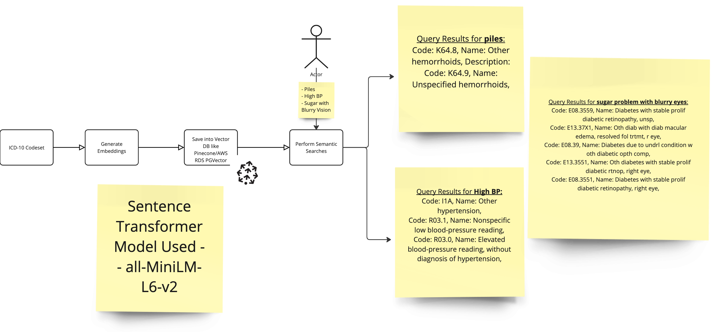

# clinical_term_search_rag_vectordb
Experiments with RAG, VectorDB, Semantic Search for Clinical Terms

## What are we trying to build?



## Environment Setup
Clone the repository.

Set up the virtual environment and install the required libraries:

```
python3 -m venv .venv
source .venv/bin/activate
pip install -r requirements.txt
```

Set the proper file path for running the app:

```
export PYTHONPATH=$(pwd)
```

Token Credits and API Key Setup

Before running the application, you need to purchase token credits for OpenAI and/or Anthropic if required.

OpenAI Credits: Purchase token credits from OpenAI.
Anthropic Credits: Purchase token credits from Anthropic.
After purchasing credits, set the following environment variables for your API keys:

```
export OPENAI_API_KEY="your-openai-api-key"
export ANTHROPIC_API_KEY="your-anthropic-api-key"
```

## Load CPT Data

```
python3 clinical_term_search/load_cpt_minillm_L12_embeddings.py
```
### Troubleshooting Tips
- The CSV file column content should not contain double quotes if double quotes are used to enclose the field.
- The CSV file column content should not contain commas if commas are used to separate the field.
- The CSV file column content should not contain new lines if new lines are used to separate the field.
- Ensure the data extracted from the CPT and ICD-10 Tables are in the correct format.

```
SELECT
   Code,
   REPLACE(Name, '"', '') AS CleanedName,
   REPLACE(Description, '"', '') AS CleanedDescription
FROM
   CPTTable;
```

- Use `tqdm` to show progress of the embedding generation.
- [taqadum](https://tqdm.github.io/) Our best friend for progress bars. 
- tqdm means "progress" in Arabic (taqadum, تقدّم) 


